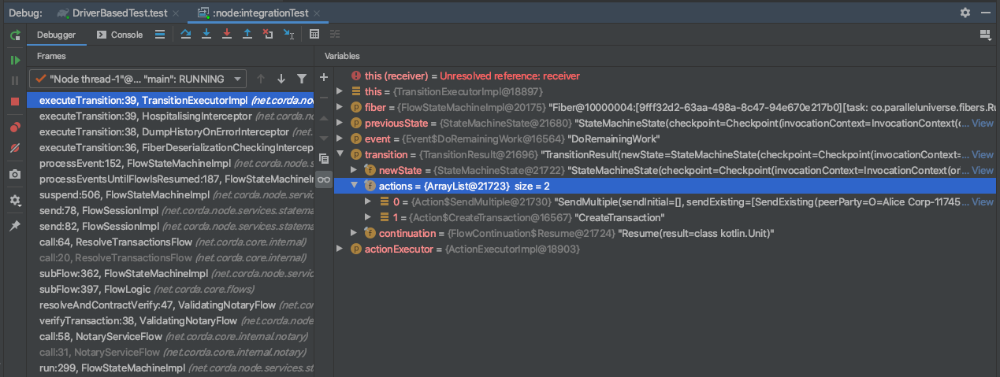
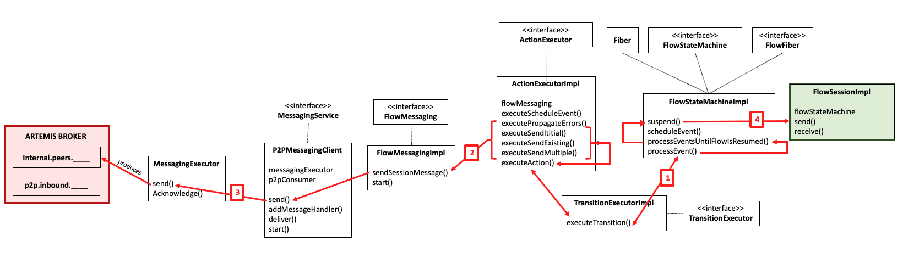
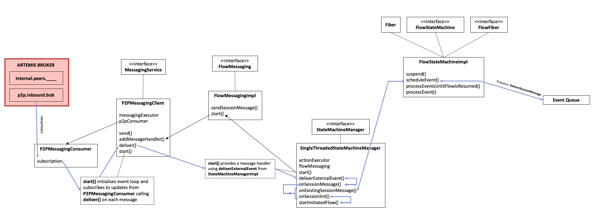
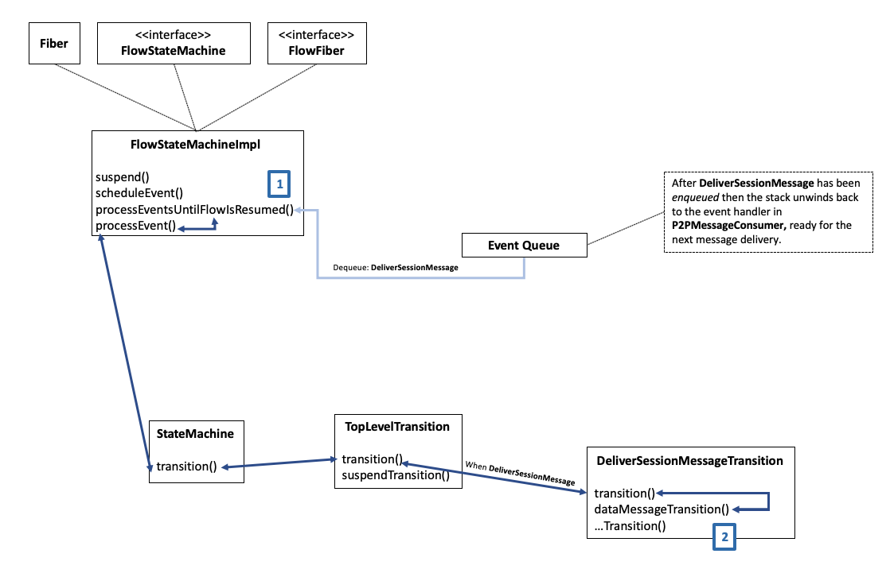
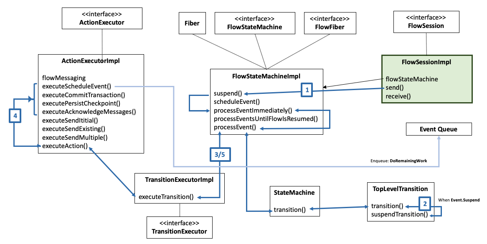
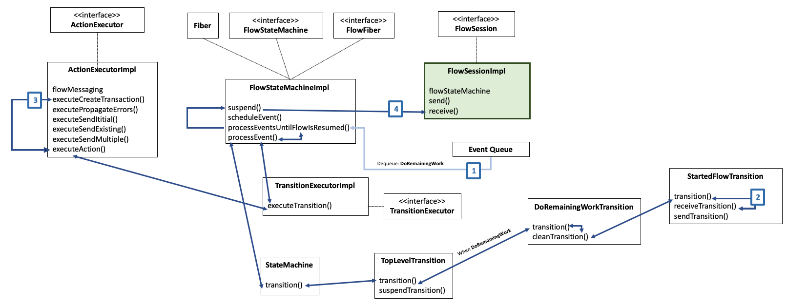

# Messaging in Corda

## Background

In order to understand messaging between Corda nodes, one must first understand some basic messaging concepts. Unless you have worked in a bank or enterprise technology environment then it's likely that you will not be familiar with message brokers and that's OK. This section introduces all the concepts you need to forge ahead.

### Asynchronous versus synchronous messaging

The first concept is understanding the difference between synchronous and asynchronous messaging. Synchronous messaging is characterised as a conversation, where both the sender and recipient machines must be available and capabable of sending and receiving messages in real-time. With a synchronous approach, when a sender sends a message, they will wait until a response is recieved from the recipient. The recipient must be available to process the message and then send a response back to the sender, which also must still be available to receive it. Typical manifestations of synchronous messaging involve remote procedure calls (RPC) where a sender invokes a function on the recipients machine via sending it a message and then waits for the a resposne which is the return value of the remote function.

With asynchronous messaging, there is no assumption that the sender or recipient must to be online to effectively participate in a messaging workflow. This is made possible by a piece of infrastructure called a message queue. Message queues receive messages from producers into a queue which can then be accessed by consumers at some point in the future. If the consumer is not available when the message is enqueued, then that's OK, they'll just receive the message when they are next available and check the queue. The broker handles persistence of the message for the time between when it is produced and consumed. We say this is durable messaging, that is, the broker ensures that the message is not "lost" for whatever reason at any point during its journey from producer to consumer. Lastly, using queues allows a producer process to continue execution after a message is sent, rather than blocking and waiting for a response as with a synchronous workflow. 

With Corda there is a requirement to provide durable and reliable messaging between any communicating set of nodes and therefore makes use of asynchronous messaging for node to node communication via the Apache Artemis MQ broker (or Artemis as we usually call it)[^artemis]. 

[^artemis]: https://activemq.apache.org/components/artemis/

### Point to point versus publish and subscribe

Point to point messaging is, more or less, what is described above, where a producer sends a message to a queue which has only one consumer. With Artermis, this is called `ANYCAST` messaging. Sometimes there might be more than one consumer for a queue but even so, each message will only be received by a single consumer. In contrast, publish and subscribe involves sending a message to any number of consumers via a "topic", such that if the topic matches a topic of interest for consumers then they will receive the message. Usually, with publish and subscribe, the publisher doesn't have knowledge of the consumers. In Artermis this is called `MULTICAST` messaging. With Corda we only use `ANYCAST` messaging for sending messages from one Corda node to another.

### Delivery semantics

Messaging systems allows administrators and application developers to tweak how reliable message delivery should be expected. There are usually three levels of relability:

* **At most once**, which guarantess that a particular message is only ever received by the subscriber a maximum of one time but of course this does mean that the message may never arrive! With this apporach, message delivery will be attempted but if something fails and the message does not reach it's destination for whatever reason, the message may be lost. 
* **At least once**, which guarentees that a message will reach it's intended recipient one or more times. The sender will continue to send the message until it receives an acknowledgment from the recipient, confirming it has received the message. The result of this approach is that the message may be received multiple times. At least once delivery can be "bootstrapped" from at most once delivery if the sender is able to store and retry delivery should the previous attempt(s) have failed.
* **Exactly once**, which ensures that a message is received by a recipient exactly one time. The recipient will never get duplicate copies of the message and will eventually get it but at the expense of additional network and processing overhead. Indeed, exctly once delivery can be bootstrapped from at least once delivery coupled with a deduplication mechanism on the recipient's side.

Corda makes use of exactly once delivery semantics.

## Basics

To provide some initial context, it is worth noting that messages originate from flows (user-defined `FlowLogic` subclasses) via `FlowSession.send` calls and are ultimately consumed via user defined `FlowSession.receive` calls. In practise, other messages are exchanged between a set of nodes during a flow — such as acknowleding message delivery — but for the purpose of this explanation, all we need to focus on are the `send` and `receive` calls defined in flows.

### The broker

For a corda node to exchange messages with its peers, it must be associated with an Artermis MQ broker. This might be an embedded broker — that is, one which is instantiated programatically during node start-up — or one which is hosted externally to the node, in which case its host name must be provided in the configuration file for the node.

Those who have experience with message brokers will probably note that it's unusual to embed a message broker into each node and you'd be right, it's not a common pattern! Instead, usually the broker is located on a server and has many clients, operating in a client-server fashion. Instead, Corda is different because the idea is to create a decentralised peer to peer network, so there must be a way for each node to queue up their own outbound messages and receive their own inbound messages. It follows that there must be a message broker (or equivalent) for each node. The brokers all provide two sets of queues for their node:

1. the inbound peer to peer queue where messages are received from other nodes, and; 
2. a set of outbound queues, where there is one for each peer

### Peer to peer bridges

In addition, there is the concept of a bridge[^bridge], which is used to create a connection from one broker in one node, to another message broker in a remote node. As Corda is intended to operate as a peer to peer network, it's likely that the bridge will make a connection to other nodes over the Internet. As each node can have many peers, there are many bridges, one for each peer in each direction as depicted below.


The bridge consumes messages from the local broker's outbound queues and pushes them to the local inbound queue for the remote node. If the message cannot be delivered then the bridge will retry delivering the message to the remote node. Only when the local Artermis Bridge for the remote node has received receipt acknowledgement from the remote node's Artermis Broker, will the message in the local outbound queue be removed.

The bridge is the most complicated part of messaging in Corda as it must handle disconnections and flakey connections, so there is a lot of defensive programming and as a consequence the code has become rather complex[^amqp-bridge].

[^bridge]: See http://activemq.apache.org/components/artemis/documentation/1.5.3/core-bridges.html
[^amqp-bridge]: See `AMQPBridgeManager.kt` and `AMQPClient.kt` for the code.

### Queue and bridge management

Usually, queues are hardcoded into the configuration of the message broker, defined in an XML or somesuch file. However, with Corda, we need the ability to create queues (and associated bridges) on the fly depending on a node's peers. Luckily, embedded Artemis gives us the ability to create queues on the broker via `ClientSession.createQueue()` and remove queues via `ClientSession.deleteQueue`(). In addition, the "bridge manager" allows us to dynamically create and destorys bridges to peers in a Corda network. 

Bridges are amended in response to updates from the network map when a new node has joined the network, changed its hostname or been removed from the network. If there isn't an internal outbound queue for a peer, then it is created on demand when a message is sent to that peer for the first time. 

The following queue names below are used for controlling the bridge and receving updates from the bridge:

```
internal.bridge.control
internal.bridge.notify
```

The node communicates with the bridge manager via messages because in some circumstances it will be deployed as an external infrastructure component, therefore one cannot assume it can always be called locally.

The following queue prefixes are used for peer to peer messaging:

```
internal.peers.					
p2p.inbound.
```

For each peer, there exists an `internal.peers.` queue with the suffix of the peer's public key. For example if `O=Alice Corp-11705, L=London, C=GB` has the public key: `abc123` the outbound queue for Alice would be `internal.peers.alice123`. 

For each node, there exists a single `p2p.inbound.` queue suffixed with the public key of the node e.g. `p2p.inbound.xyz123`.

### Security

How do we ensure messages sent via the Internet are secure? You may be aware that each node contains a certificate authority, which is used to create the node's legal identity certificate as well as a TLS certificate. The TLS certificate created by a node and the one created by its remote peer are used to bootstrap an authenticated TLS connection such that any messages sent between the two nodes cannot be read by any third parties. Corda nodes are configured to only allow the creation of TLS connections with nodes which share the same trust root.

### Messaging interface

Of course, the reality is quite a bit more complicated then what's presented above and further into this document we'll get into some of that complexity. But for now, re-assuringly, the vast majority of the complexity is hidden by the `MessagingService` interface. It's quite a nice abstraction and the main parts of it are shown below.

```kotlin
interface MessagingService : ServiceLifecycleSupport {

  fun addMessageHandler(
    topic: String, 
    callback: MessageHandler
  ): MessageHandlerRegistration
  
	fun removeMessageHandler(registration: MessageHandlerRegistration)
    
  @Suspendable
  fun send(
    message: Message,
    target: MessageRecipients,
    sequenceKey: Any = target
  )

  fun createMessage(
    topic: String, 
    data: ByteArray, 
    deduplicationId: SenderDeduplicationId = SenderDeduplicationId(
      DeduplicationId.createRandom(newSecureRandom()), 
      ourSenderUUID
    ), 
    additionalHeaders: Map<String, String> = emptyMap()
  ): Message
  
  fun getAddressOfParty(partyInfo: PartyInfo): MessageRecipients
  
  val myAddress: SingleMessageRecipient
}
```

The `MessagingService` provides an ability to send a `Message` to one or more `MessageRecipients`, which are typically remote nodes — but can also be the local node — and add `MessageHandler`s to handle incoming messages to the `p2p.inbound` queue. In the `node` codebase, the only consumer of the `MessagingService` interface is the `FlowMessaging` interface which is used by the flow `StateMachineManager` to send and receive messages. In other words, peer to peer messaging is _only_ used by flows.

## Messaging Components

In this section, we take a look at the various classes which comprise the messaging components inside a Corda node. Firstly, it's worth noting that there are two broad sides to the messaging components; those which are part of the Corda `node` internals and those which are part of the `node-api`.

The `node-api` is a dependency of the Corda node and as such, if the Corda node is running a message broker internally — where the setting `messagingServerExternal` is set to `false` — then all components are instantiated as part of the Corda node. However, if `messagingServerExternal` is set to `true` where an external message broker is being used (such as the bridge/float product) then all the components in the `node-api` area below become external to the Corda `node`.


The diagram above (zoom in to see it clearly) shows how the various classes are instantiated from the `Node` class. Only the most pertinent classes and their properties and methods have been included in the diagram. When starting up the node, the `P2PMessagingClient` is created first but not started. Next, inside `Node.start` there is a call to `Node.startMessagingService`, which instantiates the `BridgeControlListener` and `ArtemisMessagingServer`. The `Node` then starts these two components along with the `P2PMessagingClient`. The `BridgeControlListener` creates an instance of the `AMQPBridgeManager`. The `AMQPBridgeManager` creates instances of `AMQPBridge`s when they are required.

### P2PMessagingClient

The `P2PMessagingClient` is the node's implementation of the `MessagingService`. At a basic level it provides functionality to send messages to other nodes and receives (and acknowledges) messages from other nodes, but of course it does other things...

In particular, it instructs the `AMQPBridgeManager` which `AMQPBridge`s it should create and destroy. This process is all driven reactively via updates from the `NetworkMapCache`. For example: when a new node is added to the network, then all nodes will receive this update and instruct their bridge manager to create a new bridge to the peer which has just been added to the network. Note: that this is done by all nodes, so that there are bridges in both directions[^calc]. A similar process occurs when a node changes hostname — an existing bridge is destroyed and re-created with a new hostname — or when a node is removed from the network map, in which case the bridge to it is destroyed.

When a message is to be sent to a remote node, it must be produced to the corresponding `internal.peers.` queue. If that queue does not yet exist, then it is created on the fly via a call to `createQueueIfAbsent`, which also lets the `BridgeControlListener` know that it should create a corresponding `AMQPBridge`.

Lastly, this class handles message deduplification to provide _exactly once_ delivery semantics. This is done via the `P2PMessageDeduplicator`, which persists message IDs and uses them to check if any subsequent messages are duplicates. Message acknowledgement and deduplification is somewhat nuanced as the actions of the state machine manager must also be taken into account. The key thing to note is that a message can only be marked as delivered, when the associated state machine actions[^actions] the message is in respect of, are also executed and committed to the database in a single database transaction. That is, message delivery _must_ be atomic with the associated state machine transition and corresponding set of actions to be executed.

When the class in instantiated, it performs the following notable actions:

1. creates a `p2p.inbound.` queue to which remote bridges produce messages
2. Starts the `MessagingExecutor`, which produces messages to the `internal.peers.` queues. The local bridges consume messages from these queues and produce the same messages to remote node `p2p.inbound.` queues
3. Creates the `P2PMessagingConsumer`, which listens for new messages on the `p2p.inbound.` queue and consumes them via a supplied handler via `SingleThreadedStateMachineManager`
4. Registers an event handler to process incoming messages on the `bridge.control` queue — this is because the bridge might be operating in a separate process to the node
5. Determines the set of bridges — via `P2PMessagingClient.enumerateBridges` — which are required based upon the set of already existing `internal.peers.` queues registered with the Artemis broker. The bridges are created by sending a message to the `internal.bridge.control` queue, which is then picked up by the `BridgeControlListener`. This process happens because the queue definitions are persistent but the bridges are ephemeral.

When the `start` method is invoked, the `P2PMessagingConsumer` is started.

[^calc]: For a network with n > 1 nodes there are n(n - 1) bridges.  
[^actions]: Such as updating the state machine state that a message has been received. 

### ArtemisMessagingServer

After the P2PMessagingClient has been instantiated, the next messaging related action to happen is that the `ArtemisMessagingServer` is instantiated via `Node.startMessagingService`. This only happens when a full node is started. When running a `MockNode`, Artemis is replaced with a mock in memory messaging service — that's worth noting if you've ever seen different behaviour between `MockNetwork` tests and `NodeDriver` tests.

There's not much else to note here as this class doesn't expose any public API. Instead, the message broker can be interacted with via a `ClientSession`.

### BridgeControlListener

The **BridgeControlListener**, consumes `BridgeControl` messages from the `internal.bridge.control` queue and carries out the required actions, whether that is to create a new bridge, or set of bridges or destroy a bridge or set of bridges. There's not much else to note here. There isn't much of a public API because instead this component is interacted with via message queues as it might be hosted on another physical machine.

On startup a `BridgeToNodeSnapshot` message is sent to the node, requesting it enumerate all the `internal.peers.` queues, so that the required bridges can be created (one for each remote node). The node sends back a `NodeToBridgeSnapshot` message, with a list of all the required bridges. In addition to this, the `AMQPBridgeManager` is also instantiated.

### AMQPBridgeManager

The `AMQPBridgeManager` handles the requests to create and destroy bridges. It also maintains a map of local peer queue names to the associated bridge which has been deployed. That's all it does really. The file containing this class has a lot of code because the `AMQPBridge` class is defined as an internal class.

### AMQPBridge

The `AMQPBridge` itself is more complicated than the bridge manager, as there's quite a lot going on. In short, the bridge listens for messages on its associated `internal.peers.` queue and forwards them to the remote `p2p.inbound.` queue. The key thing to note here is that a message will only be removed from the local `internal.peers.` queue if it was successfully sent to the remote `p2p.inbound.` queue. Of course, that means, message delivery over the Internet must be acknowledged by the remote Artemis broker. As such, if the remote broker acknowledges message delivery, then so does the `AMQPBridge` to the local Artermis broker and thus the message is removed from the  `internal.peers.` queue and is delivered from the sending node's perspsective. If delivery acknowledgement is not confirmed from the remote Artemis broker then the message remains in the `internal.peers.` queue until delivery is acknowledged. Ensuring this works under all circumstances is tricky as the code needs to be robust in the case of flakey connections, packet loss and latency, etc.

## The journey of a message

Assuming there is some user code that defines two flows — a `PingFlow` which sends a "ping" to a remote node, and a  `PongFlow` which receives a "ping" and returns a "pong" — how does the process for sending and receiving messages actually work? Hint: it's more complicated than you think!

```kotlin
@StartableByRPC
@InitiatingFlow
class PingFlow(val recipient: Party) : FlowLogic<String>() {
    @Suspendable
    override fun call(): String {
        return initiateFlow(recipient).sendAndReceive("Ping").unwrap { message ->
						message
        }
    }
}

@InitiatedBy(PingFlow::class)
class PongFlow(val session: FlowSession) : FlowLogic<String>() {
    @Suspendable
    override fun call(): String {
        val ping = session.receive<String>().unwrap { message -> message }
        session.send("Pong")
        return ping
    }
}
```

Before we dive into the flow one must understand what a state machine is because it's a required concept to follow what comes next. It turns out that the Erlang Open Telecoms Platform (OTP) design principles documentation[^erlang] has a great explanation of event driven state machines, to the extent that it can be copy-pasted right here because it almost exactly matches how the state machine in Corda works:

> For an Event-Driven State Machine, the input is an event that triggers a **state transition** and the output is actions executed during the **state transition**. Analogously to the mathematical model of a Finite State Machine, it can be described as a set of relations of the following form:

```
State(S) x Event(E) -> Actions(A), State(S')
```

> These relations are interpreted as follows: if we are in state **S** and event **E** occurs, we are to perform actions **A**, and make a transition to state **S'**. Notice that **S'** can be equal to **S**, and that A can be empty.

> As **A** and **S'** depend only on **S** and **E**, the kind of state machine described here is a Mealy machine (see, for example, the Wikipedia article "Mealy machine").

In addition, it's worth mentioning what a Fiber (or co-routine, or continuation) is. In short, it's function that can be suspended and resumed at arbitrary points throughout its execution. As flows are co-routines, this means they can be suspended and resumed, enabling the Corda node to run multiple flows concurrently. For example, when one flow is waiting to receive a message, another flow can continue execution. You can think of this as similar to "multi-threading". However, thread execution is scheduled by the operating system where as Fiber scheduling happens at the application layer so it's possible to exercise a fair degree of control over the scheduling mechanism.

That's probably enough jargon for now. One thing to note is that this journey only describes the happy path scenario. As such, it doesn't delve into the complexities of handling errors which occur for whatever reason. That can be the subject of another paper. Now, let us first start with sending a message from a flow.

[^erlang]: See https://erlang.org/doc/design_principles/statem.html#event-driven-state-machines for more information.

### Sending messages

**From `FlowSession.send` to `FlowStateMachine.suspend`**


Sending a message starts with the `FlowSession.send` API. Calling this API does a number of things. Firstly, it serialises the object passed to it for sending. Secondly, it creates a `FlowIORequest.Send` object, indicating that this flow needs to send a message. Thirdly, the flow is suspended via a call to `FlowStateMachineImpl.suspend` **(1, in the diagram above)**. The `suspend` method creates an `Event.Suspend` object, which includes the `FlowIORequest` object as well as the serialised `Fiber`. 

The suspend method than calls the `processEventImmediately` API which immediately processes the specific `Event` which is passed to it, in this case `Event.Suspend`.

The `Suspend.Event` causes the state machine to "transition", this means that the state machine for the flow is updated to include a new checkpoint and that the flow requested to send a message **(2)**. To do this, a new checkpoint is created and a series of actions are recorded for execution[^other]:

1. The new checkpoint is persisted
2. The current database transaction is committed (A new database transaction would have been started before the user flow reached `FlowSession.send`)
3. A `DoMoreWork` `Event` is scheduled. This `Event` will ultimately cause the state machine manager to handle the `FlowIOReqest`

So, at this stage, the Quasar fiber for this flow  — up to and including the point where `FlowSession.send` is called — is parked and serialised. Later it is written to disk, this means that if there were a failure of the node for whatever reason, then the flow can be resumed from the checkpoint, which includes the call-stack up the point where `suspend` was called, and that a request to send a message to a remote node was made. Now, the state transition needs to be made and the corresponding actions executed.

The call stack unwinds back to `processEvent()` so that the recorded actions can be executed **(3)**. Next, the `TransitionExecutor` executes the `Action`s which were queued up, meaning that the checkpoint is written to the checkpoint store and the database transaction which it was in the context of, is committed **(4)**. Lastly, the `Event.DoRemainingWork` is scheduled by enqueueing it on the event queue. The call stack then unwinds back to `processEvent`() and eventually back to `suspend()` **(5)**.

[^other]: There are other actions relating to message deduplification and acknowledgement but they are not relevant at this stage.

**`FlowStateMachineImpl.processEventsUntilFlowIsResumed` and the `StateMachine`** 

The next thing `suspend` does is call `processEventsUntilFlowIsResumed`. This is quite an important method in `FlowStateMachineImpl`. The code is pasted below as it's quite useful to see what it does:

```kotlin
eventLoop@ while (true) {
  val nextEvent = try {
    eventQueue.receive()
	} catch (interrupted: InterruptedException) {
		log.error("Flow interrupted while waiting for events, aborting immediately")
    (transientValues?.value?.resultFuture as?	
    	OpenFuture<*>)?.setException(KilledFlowException(id))
    abortFiber()
	}
	val continuation = processEvent(transitionExecutor, nextEvent)
	when (continuation) {
		is FlowContinuation.Resume -> {
			return continuation.result
		}
		is FlowContinuation.Throw -> 
    	throw continuation.throwable.fillInLocalStackTrace()
		FlowContinuation.ProcessEvents -> continue@eventLoop
		FlowContinuation.Abort -> abortFiber()
	}
}
```

As can be seen, it's essentially an event loop whch receives `Event`s from a queue, processes them via `processEvent()` and then, depending on the result of the processed `Event`, either resumes execution of the flow, processes more events, aborts execution or throws an exception. 

In the context of sending a message, this method will be called by `suspend()` and because `Event.DoRemainingWork` was scheduled, it will be waiting for the flow Fiber on the queue[^queue]  **(1)**.


Next, the `processEvent()` method will be called **(2)** with the next event, this is where the state machine starts handling the `FlowIORequest` via the `StateMachine` **(3)**. There are various transition classes and in this case, the flow of execution ends up in the `StartedFlowTransition` **(4)** which describes what should happen with a `FlowIORequest`. The `sendTransition()` method handles the specific transition. This method creates a list of `Action`s for each message to be sent. Note there can be many actions to execute if many messages are to be sent but in this example only one message will be sent and it's a message created in the context of a new flow session between two nodes, so `Action.SendInitial` is used. Otherwise, for an existing flow session, `Action.sendExisting` would be used.

Next, because message sending is asynchronous, the flow is set to resume execution but before anything can be done, `Action.CreateTransaction` is added to the list of actions because a new database transaction should be created for all the new things which may happen[^things] since the last transaction was committed. The flow is set to resume execution by the `sendTransition()` method returning the `FlowContinuation.Resume` class. This signals to the event loop in `processEventsUntilFlowIsResumed` to exit the loop and continue execution of the `FlowLogic`.

After all this is done, the call stack unwinds back to `processEvent()` so that the recorded actions can be executed.

[^queue]: This "queue" is called a "channel" in Quasar parlence and facilitates the sending of a message to a Fiber. This is very similar to how messages work in Erlang, or channels work in Go
[^Things]: Like using `withEntityManager` or recording transactions and vault entries. All these things need to be done in the context of a database transaction. 

**ActionExecution**

This is where the actual message sending happens. After the next state and list of actions have been determined, the `TransitionExecutor` is invoked **(1)**, which iterates through the list of actions and executes each one via the `ActionExecutor`. The `ActionExecutor` is basically a big `when` statement with instructions for what to do for each action. In our case, sending a message requires a code path which involves the `MessagingService`.



In the picture above, you can see a debugging session with a breakpoint situated in the `ActionEcutorImpl` class before the next list of actions are to be executed for sending a message. As mentioned previously, the two actions to execute are to send a message and to create a transaction. Also, the continuation state is set to `Resume`.



From the `ActionExecutor`, the `FlowMessaging` API is called to `sendSessionMessage()` **(2)**. This takes a `SessionMessage` and does some checking to see that the `Desination` for the message is a valid `Party`. It also serializes the `SessionMessage` and wraps it with an implementation of the `Message` class. It's worth noting here that if the message is an initial session message then it also contains some metadata such as the `FlowLogic` sub-class which the remote node should instantiate upon receiving the message and the session ID for the sender. If the message is for an exisitng session, then the session ID for the remote node is included, so that it can easily match up the received message to the correct flow state machine.

```kotlin
data class InitialSessionMessage(
        val initiatorSessionId: SessionId,
        val initiationEntropy: Long,
        val initiatorFlowClassName: String,
        val flowVersion: Int,
        val appName: String,
        val firstPayload: SerializedBytes<Any>?
) : SessionMessage() 
```

```kotlin
interface Message {
    val topic: String
    val data: ByteSequence	// The serialized `SessionMessage`.
    val debugTimestamp: Instant
    val uniqueMessageId: DeduplicationId
    val senderUUID: String?
    val additionalHeaders: Map<String, String>
}
```

Next, the local queue name for the target peer is looked-up and the `Message` is wrapped in an `AddressedMessage` class:

```kotlin
data class AddressedMessage(
        val message: Message,
        val target: MessageRecipients,
        val sequenceKey: Any = target
)
```

From this point **(3)**, the `MessagingService` passes on the `AddressedMessage` to the `MessagingExecutor`, which then checks that the internal peer queue exists and if not, then creates it and then sends the message. That's it! The call stack then unwinds all the way back to `processEventsUntilFlowIsResumed` which then exists the event loop and returns to the `FlowSessionImpl` class where execution of the user flow resumes **(4)**. 

### Receiving messages

Receiving messages is more complicated than the sending because there are two code paths to consider:

1. We need to follow what happens when a message is received by the local Artermis broker on the `p2p.inbound.` queue and how it makes its way to the `FlowStateMachineImpl` event queue.
2. We also need to follow what happens when a flow is suspended such that it can receive and process a message.

**Delivering a message from the p2p.inbound queue to the flow event queue**

This happens independently to a user flow hitting a `flowSession.receive` block and suspending. Indeed, it might be the case that the `ExistingSessionMessage` message delivered to the flow state machine manager is not relevant for any running flow, or an `InitialSessionMessage` cannot instantiate the specified flow by `InitialSessionMessage.initiatorFlowClassName` because it doesn't exist on the local machine.



During start-up of all the various messaging components an event handler — defined in `SingleThreadedStateMachineManager` — for incoming peer to peer messages is passed to `FlowMessagingImpl`:

```kotlin
flowMessaging.start { _, deduplicationHandler ->
    executor.execute {
        deliverExternalEvent(deduplicationHandler.externalCause)
    }
}
```

This handler dispatches existing session or new session messages to where they are handled inside `SingleThreadedStateMachineManager`. The handler is registered inside the `P2PMessagingClient` when it starts up. Additionally, when the `P2PMessagingClient` starts-up it creates an instance of `P2PMessagingConsumer` which listens for new messaging in the `p2p.inbound` queue. When a message is received, the `P2PMessagingService.deliver` method is called, which in-turn invokes the handler which was registered at start-up. 

The `deliver` method handles de-duplification of the message to be delivered such that if the message has been seen before then it is dropped and a note is added to the logs that it was a duplicate and dropped. Processed message IDs are only persisted via a the database transaction for the flow the message is in respect of completes. Therefore, there is a period between when the message is seen and when it is persisted and during this period, Artermis might try to re-deliver the message as acknowledgements are only sent when the message ID is persisted. As such, the message deduplification handler also maintains an in memory "being processed" list which is updated immediately after the duplicated check. Note: that this is _just_ the happy-path scenario — there are various others which are not discussed here. 

So, with the above in mind, when a message is pushed to the `p2p.inbound` queue, it makes it's way through the various handlers to either `onSessionInit` or `onExistingSessionMessage` in `SingleThreadedStateMachineManager`. 

For existing flow sessions, the flow session ID is looked up to retrive the `FlowStateMachineManegerImpl` for the flow and then the message is enqueued in the event queue. That's it!

**How `InitiatedBy` flows start**

For new flow sessions, it's a bit more complicated as the flow needs to be set up and started. This follows the same process as starting a flow via RPC. The flow begins with an `Unstarted` state and the `DoRemainingWork` event enqueued in the event queue. In the `DoRemainingWork` transition executor, some actions are specified to start a new database transation, create and persist a new checkpoint, acknowledge the initial session message — by sending an acknowledgement back to the sending node — and then commit the database transaction. Most importantly, the initial session message is added to the `receivedMessages` list in the flow state so that when the flow starts execution and reaches the `receive` call, then the message can be retrieved by the process explained below. 

**Retrieving messages stored in the flow state**

Let's assume that at some point before a `receive` call is hit, the `DeliverSessionMessage` event is handled — it updates the received messages part of the state machine state with the new message. 




Later on, at the point a started flow hits a `recieve` call, the flow is suspended in the same way that is it for sending a message. At this point any received messages are acknowledged. A `DoRemainingWork` event is enqueued.



Next, the `DoRemainingWork` transition is handled:



The key points to note here are that **(1)** the `DoRemainingWork` event is dequeued and handled **(2)**. The `receiveTransition` method in `StartedFlowTransition` returns an object containing the received messages which is eventually passed back through `suspend` to the call to `recieve`. The flow continuation state is set to `Resume` so that when the event loop in `processEventsUntilFlowIsResumed` will be exited. In the meantime, a new database transaction is created in anticipation of resuming the flow **(3)**. Lastly, the flow of execition returns to the users flow code — the `receive` call returns the message received from the remote node. 

# Appendix

For a really complicated overview of how message sending and receiving works in Corda then you can refer to this diagram below. Please zoom in to see the text clearly.

